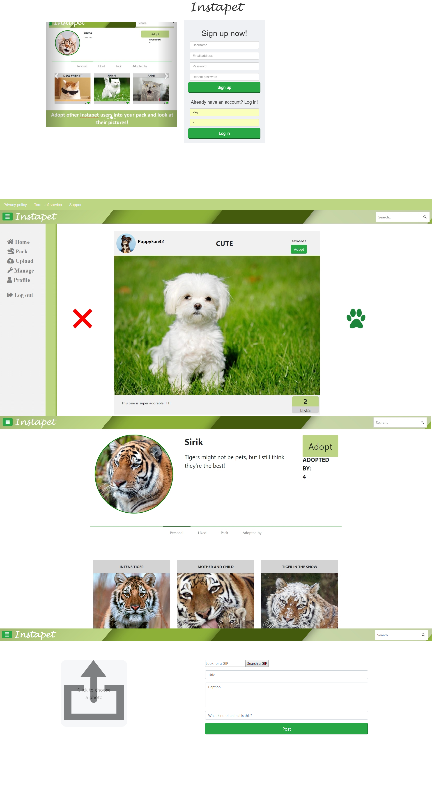

# website
Instapet

<b>Gemaakt door:</b>
Sirik Scherer, Joey Krop, Emma Tas en Max Nieboer

Het doel van onze webapplicatie is om een platform te maken voor (huis)diereigenaren en dierliefhebbers, zodat ze foto’s kunnen delen met gelijkgestelden. Op deze manier kunnen ze makkelijk in contact komen met andere huisdiereigenaren en foto's bekijken die voor hen relevant zijn. Het idee is er om de like/dislike functie van Tinder te gebruiken op een Instagram achtige omgeving.

<b>productvideo:</b>
[productvideo](https://youtu.be/uZFoKJNt1P4)

<b>Inhoud van de website</b>
1.  ontvangstpagina voor niet-ingelogde gebruikers (index)
2.  homepage voor ingelogde gebruikers (home)
    1. Random foto's
    2. Like/dislike systeem
    3. Geen dubbele foto's
3.  timeline (pack)
    1. foto's van packmembers
4.  profielpagina (profile)
    1. Eigen foto’s
    2. Gelikete foto’s
    3. Volgend (packmembers).
    4. Gevolgd door (adopted by:)
5.  search
6.  persoonlijke instellingen (manage)
7.  uploadpagina (upload)

<b>Features</b>
1.	comments
2.	like/dislike
3.	volgen/ontvolgen
4.	foto’s/ gifjes uploaden (met beschrijving)
5.	inloggen/uitloggen
6.	account beheer
7.  registreren
8.  search (de gebruiker kan zoeken op username, profielnaam, foto-titel en diersoort)
9.  een foto die eenmaal is geliked of disliked wordt niet meer weergegeven op de home en pack pagina's

<b>Wie heeft wat gedaan</b>
Er is veel samengewerkt tussen de teamleden, waardoor één functie binnen de website (zoals bijvoorbeeld de fotoweergave) niet door maar één persoon is gemaakt, maar door bijna alle groepsleden. Wel is er een splitsing gekomen in welke onderdelen elk teamlid het vaakst mee bezig was, of eindverantwoordelijk voor was.

- Sirik heeft zich voornamelijk bezig gehouden met de python code, maar heeft ook meegeholpen aan de HTML bestanden. Hij heeft (samen met Joey) ook gezorgd dat de communicatie tussen HTML en python soepel verloopt. Verder heeft hij veel functies geschreven die communiceren met de database. Ook hielp Sirik mee met het maken van afwegingen tussen het gebruik van Python en Javascript.

- Joey heeft zich bezig gehouden met het opzetten van de HTML pagina's met de benodigde python en javascript functionaliteiten. Tegen het einde van het project heeft hij ook nog een deel van de stijling opgepakt, zoals die van de profielpagina. Ook had Joey de taak op zich genomen om de Giphy API te implementeren.

- Emma heeft zich aan het begin van het project vooral bezig gehouden met python, en dan voornamelijk met application.py. Zo heeft ze (samen met Sirik) de meest essentiele functies (inloggen, registreren en uploaden) gemaakt. Later in het project heeft ze gewerkt met HTML en CSS bij het maken van de opmaak van de website. Hierin heeft ze niet zo zeer gezorgd dat de juiste informatie werden doorgestuurd vanaf de HTML pagina's naar application.py, maar juist aan dat de website er net en verzorgd uit ziet.

- Max zorgde voor een gestructureerde opbouw van de HTML pagina's en hoe dit er vervolgens uit kwam te zien op de frontend. Hij heeft hierbij ook gezorgd dat de benodigde JavaScript functies er in zaten en goed werkten.

<b> repository </b>
- In <b>helpers.py</b> vind je alle functies die te maken hebben met de database. Als iets in de database moet komen, of eruit gehaald moet worden, dan staan deze functies in helpers.py. Ook staan er kleinere functies in helpers.py die vaker aangeroepen worden in application.py, om zo dubbele code te verminderen.
- In <b>application.py</b> staat alle communicatie met de HTML pagina's. Hier wordt opgehaald wat is ingevuld in de forms en hier worden ook variabelen meegegeven aan HTML paginas.
- In de map <b>templates</b> staan alle HTML pagina's
- In de mappen <b>foto_upload</b> en <b>pf_upload</b> staan de door de gebruiker geuploade fotos en profielfoto
- CSS bestanden staan in de map <b>static</b>
- In de map <b>preview_foto</b> staan alle fotos die standaard op de site staan, zoals die in de carrousel
- Het merendeel van de JavaScript zit in het bestand <b>scripts.js</b>

<b>Afhankelijkheden</b>
1. [Giphy API](http://api.giphy.com)

<b>Externe componenten</b>
1. Bootstrap
2. Database
3. Flask

<b>Concurrende bestaande websites</b>
1. [Instagram](http://www.instagram.com): Opbouw van profielen met verschillende keuze mogelijkheden om verschillende foto's te zien vanaf profiel pagina. Trending pagina.
2. [Tinder](http://www.tinder.com): Like/dislike swipte functie waardoor je maar één foto tegelijk ziet.
3. [Youtube](http://www.youtube.com): Menu structuur (aan linkerkant) en algemene opbouw van structuur

